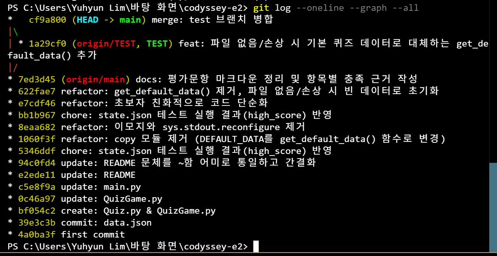
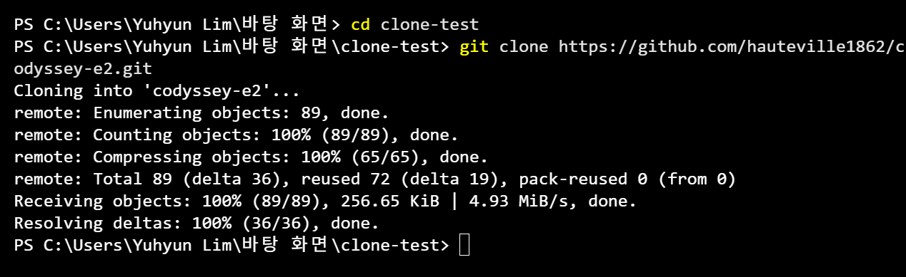
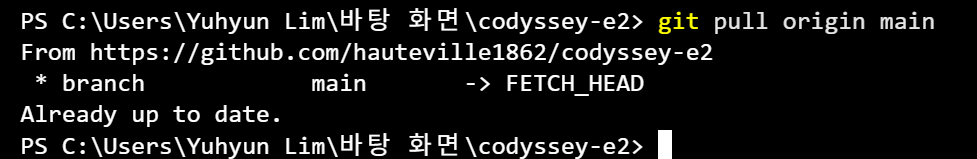

# 세계 문학 작가 퀴즈

터미널에서 동작하는 콘솔 기반 퀴즈 게임. Python 클래스와 JSON 파일 입출력으로 퀴즈 풀기·추가
기능을 구현하고, 종료 후 재실행해도 데이터(문제·최고 점수)가 유지되도록 함.

## 1. 프로젝트 개요

- **분야**: 입학연수 · 개발 입문 미션 (Python + Git 기초)
- **형태**: 콘솔 퀴즈 게임 1개 + GitHub 저장소 1개
- **핵심 기능**: 퀴즈 풀기 / 퀴즈 추가 / 퀴즈 목록 보기 / 최고 점수 확인
- **핵심 학습 목표**
  - 클래스(`Quiz`, `QuizGame`, `Storage`)로 역할을 나눠 코드를 구조화함
  - JSON 파일(`state.json`)로 데이터를 저장·불러와 데이터 영속성을 구현함
  - 잘못된 입력, 파일 손상, 강제 종료(Ctrl+C) 상황에서도 안전하게 동작하도록 예외 처리함
  - Git으로 기능 단위 커밋 및 브랜치 작업 이력을 관리함

## 2. 퀴즈 주제 선정 이유

주제는 **세계 문학 작가**. 평소 관심 있던 고전 문학 작품의 저자를 정리하며 공부할 겸, 단순
암기가 아니라 "작품 → 작가"를 연결해 떠올리는 문제를 만들고자 선정함. 빅토르 위고, 조지 오웰,
헤르만 헤세, F. 스콧 피츠제럴드, 표도르 도스토옙스키 등 시대와 국가가 다른 작가 5명을 기본
문제로 구성해 다양성을 갖춤.

## 3. 실행 방법

Python 3.10 이상 필요 (표준 라이브러리만 사용, 외부 패키지 설치 불필요).

```bash
cd apps
python main.py
```

실행 후 메뉴에서 번호(1~5)를 입력해 기능을 선택함.

```
========================================
      세계 문학 작가 퀴즈
========================================
  1. 퀴즈 시작
  2. 퀴즈 추가
  3. 퀴즈 목록 보기
  4. 최고 점수 확인
  5. 종료
----------------------------------------
메뉴를 선택하세요 (1-5):
```

> `state.json`은 상대경로(`"state.json"`)로 열기 때문에 **반드시 `apps` 폴더에서 실행**해야
> 함(`cd apps && python main.py`). 다른 위치에서 실행하면 그 위치의 `state.json`을 찾지 못해
> 기본 퀴즈 데이터(5문제, `Storage.get_default_data()`)로 시작함.

## 4. 기능 목록

| 메뉴 | 기능 | 설명 |
|---|---|---|
| 1 | 퀴즈 시작 | 저장된 문제를 순서대로 출제하고 정답/오답을 즉시 알려줌. 모든 문제를 풀면 최종 점수를 표시하고, 기존 최고 점수보다 높으면 `state.json`에 갱신·저장함. 등록된 문제가 없으면 안내 후 메뉴로 복귀함. |
| 2 | 퀴즈 추가 | 문제 내용, 보기 4개, 정답 번호(1~4)를 입력받아 `state.json`에 새 문제로 추가함. |
| 3 | 퀴즈 목록 보기 | 등록된 모든 문제와 정답 번호를 목록으로 표시함. |
| 4 | 최고 점수 확인 | 지금까지 기록된 최고 점수를 표시함. |
| 5 | 종료 | 프로그램을 안전하게 종료함. |

### 입력 예외 처리

메뉴 선택, 퀴즈 정답, 정답 번호 입력 등 숫자를 입력받는 모든 곳에서 아래 케이스를 처리함.

- 입력 앞뒤 공백 제거 후 처리 (예: `" 1 "` → `1`)
- 숫자가 아닌 값(`abc` 등) 입력 시 안내 후 재입력
- 허용 범위를 벗어난 숫자(메뉴 `9`, 정답 `0` 등) 입력 시 안내 후 재입력
- 빈 입력(Enter만 입력) 시 안내 후 재입력
- 문제/보기 내용은 빈 문자열을 허용하지 않고 재입력을 요구함

`Ctrl+C`(`KeyboardInterrupt`) 또는 입력 스트림 종료(`EOFError`) 발생 시 트레이스백 없이 안내
메시지를 출력하고 정상 종료(exit code 0)함.

`state.json`이 없거나(첫 실행) 손상되어 파싱에 실패하면 `Storage.get_default_data()`가 제공하는
기본 퀴즈 데이터(5문제, 최고 점수 0)로 자동 초기화함(손상된 경우 파일에도 다시 저장).

## 5. 파일 구조

```
codyssey-e2/
├── README.md          # 프로젝트 설명 문서 (본 파일)
├── .gitignore
├── docs/
│   ├── mission-2       # 미션 요구사항 원문
│   └── evaluations.md  # 평가문항
├── img/
│   ├── git-log-oneline.png  # 브랜치 병합 확인용 git log 스크린샷
│   ├── git-clone.png        # clone 실습 스크린샷
│   └── git-pull.png         # pull 실습 스크린샷
└── apps/
    ├── main.py          # 진입점: 메뉴 출력, 입력 검증, 화면 출력 등 CLI(입출력) 담당
    ├── quiz.py          # Quiz 클래스: 문제 1개(question/choices/answer)를 표현
    ├── quiz_game.py     # QuizGame 클래스: 진행 상태·점수 계산 등 순수 게임 로직 담당(입출력 없음)
    ├── storage.py       # Storage 클래스: state.json 로드/저장, 기본 퀴즈 데이터 제공
    └── state.json       # 퀴즈 데이터 + 최고 점수 저장 파일 (UTF-8)
```

### 클래스 책임 분리

- **`Quiz`** — 문제 하나의 데이터만 표현하는 값 객체. `question`(문제), `choices`(보기 4개),
  `answer`(정답 번호 1~4) 속성을 가짐.
- **`QuizGame`** — 퀴즈 진행 상태만 관리하는 순수 로직 클래스. 다음 문제가 남았는지 확인하고
  (`still_has_questions`), 현재 문제를 꺼내주고(`get_current_question`), 제출된 답을 채점해
  점수를 누적함(`submit_answer`). `print`/`input`을 전혀 쓰지 않아 화면 출력과 완전히 분리돼
  있음 — 그래서 콘솔 없이도(예: 자동화된 테스트) 채점 로직만 따로 검증할 수 있음.
- **`Storage`** — `state.json` 파일 입출력을 전담. 파일을 읽어 오고(`load`), 저장하며(`save`),
  파일이 없거나 손상된 경우 사용할 기본 퀴즈 데이터를 제공함(`get_default_data`).
- **`main.py`** — 메뉴 출력, 입력 검증(`get_valid_int`), 문제/보기 출력 등 **모든 화면 입출력**을
  담당. `Quiz`/`QuizGame`/`Storage`는 서로의 존재를 몰라도 되도록 설계돼 있고, `main.py`가
  `Storage`가 돌려준 `dict`를 `Quiz` 인스턴스로 변환해 `QuizGame`에 넘기고, `QuizGame`의 판정
  결과를 받아 화면에 출력하는 조립 역할을 함.

> 이렇게 "입력 처리(검증)"는 `main.py`의 `get_valid_int`, "게임 진행(채점·점수)"은
> `QuizGame`, "데이터 저장/불러오기"는 `Storage`로 분리했다. `QuizGame`이 처음엔 `input`/
> `print`까지 직접 하고 있었는데, 그렇게 두면 채점 로직만 따로 테스트하거나 재사용하기 어려워
> 화면 입출력 책임을 `main.py`로 옮기는 리팩터링을 거쳤다.

## 6. 데이터 파일 설명 (`state.json`)

- **경로**: `apps/state.json` (상대경로 `"state.json"`으로 열므로 `apps` 폴더에서 실행해야 함), 인코딩은 UTF-8
- **역할**: 등록된 전체 퀴즈 목록과 최고 점수를 저장해 재실행 후에도 데이터를 유지함
- **스키마**

  ```json
  {
    "high_score": 0,
    "questions": [
      {
        "question": "'레 미제라블'의 저자로 프랑스의 대문호인 작가는?",
        "choices": ["빅토르 위고", "에밀 졸라", "기 드 모파상", "알베르 카뮈"],
        "answer": 1
      }
    ]
  }
  ```

  | 필드 | 타입 | 설명 |
  |---|---|---|
  | `high_score` | `int` | 지금까지 기록된 최고 점수(맞힌 문제 수) |
  | `questions` | `list[dict]` | 등록된 전체 문제 목록 |
  | `questions[].question` | `str` | 문제 내용 (`Quiz.question`에 대응) |
  | `questions[].choices` | `list[str]` (4개) | 보기 4개 (`Quiz.choices`에 대응) |
  | `questions[].answer` | `int` (1~4) | 정답 보기 번호 (`Quiz.answer`에 대응) |

  `question`/`choices`/`answer`처럼 필드에 이름을 붙인 `dict`를 사용하면 리스트로만 저장하는
  것보다 값의 의미가 명확하고, 필드가 추가되어도(예: 힌트) 기존 데이터와 호환되도록 확장하기 쉬움.

## 7. Git 작업 이력

기능(`get_default_data()` 추가)을 `TEST` 브랜치에서 작업한 뒤 `main`으로 병합함.



- `TEST` 브랜치에서 커밋(`1a29cf0 feat: ...get_default_data() 추가`)
- `main`으로 병합(`cf9a800 merge: test 브랜치 병합`)
- 위 스크린샷(`git log --oneline --graph --all` 실행 결과)에서 브랜치 분기와 병합 지점을 확인할 수 있음

### clone 실습



- 별도 로컬 디렉터리(`clone-test`)에서 `git clone https://github.com/hauteville1862/codyssey-e2.git`
  실행. 원격 저장소를 새 디렉터리(`clone-test/codyssey-e2`)로 복제함.

### pull 실습



- 기존 작업 디렉터리에서 `git pull origin main` 실행 결과. 이미 로컬이 원격과 동기화된
  상태라 `Already up to date.`로 응답함.